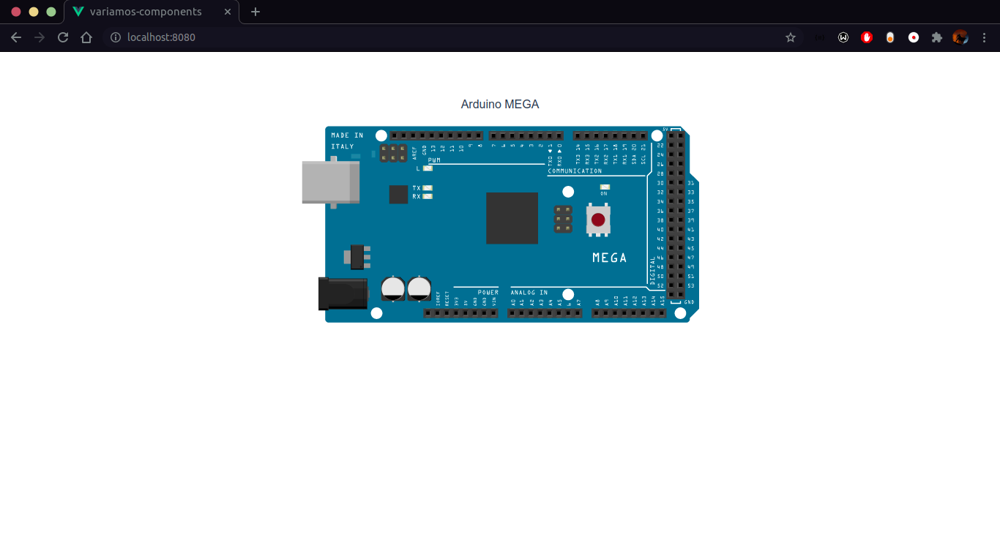
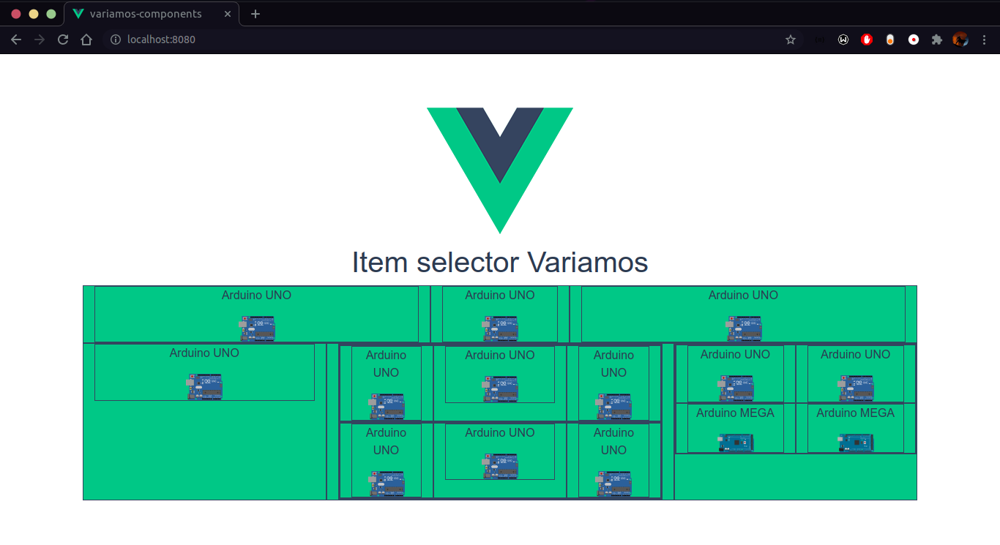

# Variamos Components

This repository is kind of like a box, where I stores some components that will be merged on [VARIAMOS](https://variamos.com/).

## Project setup
```
yarn install
```

### Compiles and hot-reloads for development
```
yarn serve
```

### Compiles and minifies for production
```
yarn build
```

### Lints and fixes files
```
yarn lint
```
## Selectable Item

### Structure

- name: The name of the item
- url: The path of the item image.
- imgWidth: Clearly the item image width.

### How to use it?

import it

```
import SelectableItem from "${ComponentPath}/SelectableItem.vue";
```

Add it to components

```
components: {
    ...
    SelectableItem,
    ...
},
```

And finally use it wherever you want like this:

```
<SelectableItem :name="SecondItem.name" :url="SecondItem.url" />
```

It should look like this:



<br>

### The component could be placed wherever you want

This is an example of the component flexibility just using `Bootstrap` and `Vue`.

